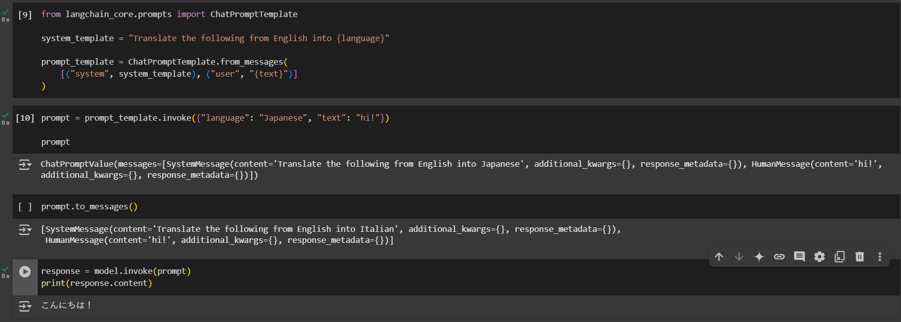
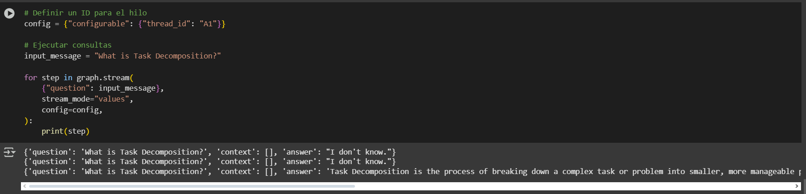

# 🚀 AREP-MANUELS-TALLER08  

This repository contains a project exploring the use of **RAG (Retrieval-Augmented Generation)** and **LangChain** for developing advanced applications with language models (LLMs).  

---

## 📌 Project Description  

This project is divided into two main parts:  

1. **Tutorials** 📚  
   - **pinecone.ipynb** 🟢 → Introduction to Pinecone for vector storage.  
   - **RAGtutorial.ipynb** 🟠 → Explanation of RAG (Retrieval-Augmented Generation).  
   - **TutorialLLM_CHAIN.ipynb** 🔵 → Using LangChain for language models.  

2. **RAG Project** 🎯  
   - **RAGT08ManuelS.ipynb** 🛠️ → Final implementation of the RAG model.  

---

## 📋 Requirements  

To run this project, you need:  

✅ **Python 3.8+** 🐍  
✅ **OpenAI account** 🔑  
✅ **Installed dependencies** 📦  

---

## ⚡ Installation  

Follow these steps to set up the project:  

1️⃣ **Clone this repository** 📂  

```bash
git clone https://github.com/your_user/AREP-MANUELS-TALLER08.git
cd AREP-MANUELS-TALLER08
```

2️⃣ **Install dependencies** 🏗️

```bash
pip install -r requirements.txt
```

3️⃣ Set up environment variables 🌍

```bash
OPENAI_API_KEY=your_openai_key
```
## 📂 Project Structure

```
AREP-MANUELS-TALLER08/
├── RAG project/
│   └── RAGT08ManuelS.ipynb  🛠️ Final implementation
├── Tutorials/
│   ├── pinecone.ipynb  🟢 Introduction to Pinecone
│   ├── RAGtutorial.ipynb  🟠 Explanation of RAG
│   ├── TutorialLLM_CHAIN.ipynb  🔵 Using LangChain
├── .gitignore  🚫 Git ignore file
├── LICENSE  📜 Project license
├── README.md  📖 Documentation
```
## 🏃‍♂️ Usage
To run the notebooks, open Jupyter Notebook or Google Colab and follow the steps inside each .ipynb file.
Example of loading an LLM model with LangChain:




👤 Author
Manuel Suárez 🚀
